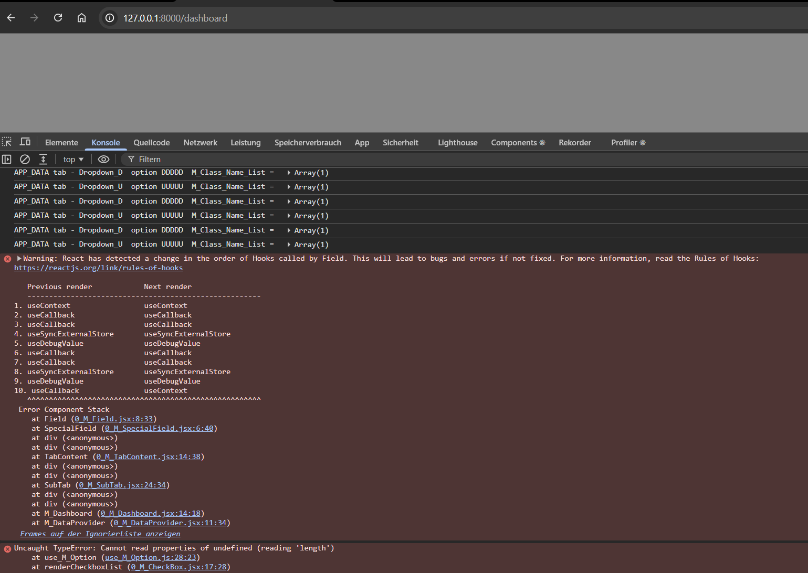

# TODO today

#### AI Gimini said:

```text
Roadmap สำหรับวันนี้:
UI Completion: ทำให้ UI ของตัว Dropdown และ Field Params สมบูรณ์และพร้อมใช้งานที่สุด

```

```text
โน้ตสรุปแผนงานเมื่อวานที่ยังทำไม่มเสร็จ:

4. ทำให้ CU Checkbox and U Dropdown ใช้งานได้จริง (Full Persistence):

เป้าหมาย:
 4.1 เมื่อติ๊ก CU แล้ว ต้องบันทึกค่าลงใน: Backend
 4.2 when change selected U Dropdown ต้องบันทึกค่าลงใน: Backend

```

### ----------------------------------

#### งานวันนี้

### FIX THIS BUG = Error when select checkbox FOREIGN



```log
installHook.js:1 Warning: React has detected a change in the order of Hooks called by Field. This will lead to bugs and errors if not fixed. For more information, read the Rules of Hooks: https://reactjs.org/link/rules-of-hooks

   Previous render            Next render
   ------------------------------------------------------
1. useContext                 useContext
2. useCallback                useCallback
3. useCallback                useCallback
4. useSyncExternalStore       useSyncExternalStore
5. useDebugValue              useDebugValue
6. useCallback                useCallback
7. useCallback                useCallback
8. useSyncExternalStore       useSyncExternalStore
9. useDebugValue              useDebugValue
10. useCallback               useContext
   ^^^^^^^^^^^^^^^^^^^^^^^^^^^^^^^^^^^^^^^^^^^^^^^^^^^^^^
 Error Component Stack
    at Field (0_M_Field.jsx:8:33)
    at SpecialField (0_M_SpecialField.jsx:6:40)
    at div (<anonymous>)
    at div (<anonymous>)
    at TabContent (0_M_TabContent.jsx:14:38)
    at div (<anonymous>)
    at div (<anonymous>)
    at SubTab (0_M_SubTab.jsx:24:34)
    at div (<anonymous>)
    at div (<anonymous>)
    at M_Dashboard (0_M_Dashboard.jsx:14:18)
    at M_DataProvider (0_M_DataProvider.jsx:11:34)

```

1. แก้บั๊ก "Rules of Hooks" (สำคัญที่สุด):

จุดที่ต้องแก้: 0_M_Field.jsx (บรรทัดที่ 8 เป็นต้นไป)

วิธีแก้: ต้องตรวจสอบว่ามีการใช้ if ครอบ useContext หรือ useCallback หรือไม่ และต้องมั่นใจว่าทุกรอบที่ Render (ไม่ว่าจะ s:: หรือ f::) จำนวนและลำดับของ Hooks ต้องเหมือนเดิมเป๊ะๆ

แนวทาง: ให้ดึง Hook ทั้งหมดออกมาไว้ที่ส่วนบนสุดของ Component Field โดยไม่มีเงื่อนไข (Unconditional) แล้วค่อยใช้ข้อมูลภายในเพื่อตัดสินใจว่าจะ Render อะไรใน return แทนครับ

2. จัดการเป้าหมายเดิม (4.1 & 4.2):

CU Checkbox & U Dropdown Persistence (ต้องบันทึกค่าลง Backend ได้จริง)

##### ถ้าทำ 1. 2. เสร็จถือว่า workday 100% complete

#### ถ้าเริ่มต้นทำ 3. ด้วยซัก 20-30๔ จะถือว่าดี เอาเวลาที่เสียคืน เพราะเมื่อวานทำง่านไม่เสร็จ 100%

3. งานฟีเจอร์เพิ่ม/ลบ (Add & Delete Field):

เพิ่ม (Add Field): สร้างฟังก์ชันที่รับชื่อ Field ใหม่ และ Default Metadata เข้าไปใน GLOBAL_METADATA หรือ M_Value

ลบ (Delete Field): สร้างฟังก์ชันที่ filter เอา Key ที่ไม่ต้องการออกไปจาก M_Value แล้วสั่ง Trigger update เพื่อให้หน้าจอ Render ใหม่

หมายเหตุ: งานนี้จะเน้นที่การแก้ไข M_Value ก้อนหลักที่อยู่ใน Zustand ครับ

```

```
