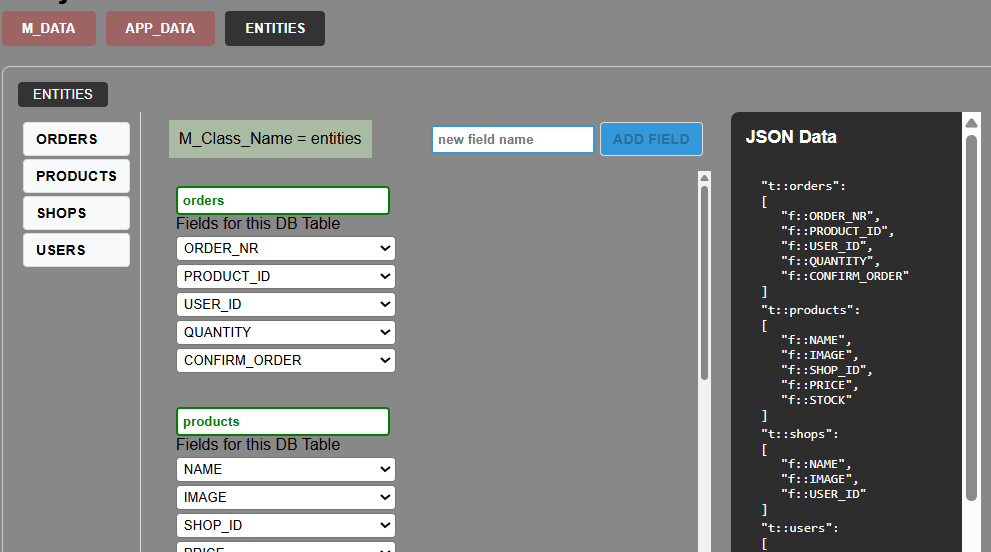

# TODO today

#### งานวันนี้



```text
1. ระบบอัปเดตชื่อ Field แบบ Real-time (onChange):

แก้ไขช่อง Input ชื่อ Field ขนาดย่อ ให้ซิงค์อัปเดตส่งค่าไปที่ Backend ทันทีแบบอัตโนมัติทุกครั้งที่มีการพิมพ์ (onChange) โดยไม่มีปุ่ม Save

2. จัดการโครงสร้างหน้า Entities:

ปรับแก้ปุ่มและพฤติกรรมการเพิ่มข้อมูลในหน้า Entities ให้รองรับการ Add Table หรือ Add Field แยกตามราย Table ให้ถูกต้องตามโครงสร้างข้อมูลจริง
```

```javascript
// ใน use_M_Store
selected_D_Values: {}, // เก็บเป็น { fieldname: "STRING" }
setSelected_D_Global: (fieldname, value) => set(state => ({
    selected_D_Values: { ...state.selected_D_Values, [fieldname]: value }
})),

// in renderDropdown D  (similar for dropdown U)
const [selected_D, set_Selected_D] = useState(defaultValue);

// เพิ่ม useEffect ตัวนี้เพื่อเป็นสะพาน
useEffect(() => {
    // เมื่อ Store เปลี่ยน (เช่นโดนสั่งให้ล้างจาก FOREIGN) ให้ Local State เปลี่ยนตาม
    const globalValue = use_M_Store.getState().selected_D_Values[fieldname];
    if (globalValue !== undefined) {
        set_Selected_D(globalValue);
    }
}, [use_M_Store.getState().selected_D_Values[fieldname]]);

//แก้ set_D_Actions ให้แตะทั้งสองที่:

JavaScript
async function set_D_Actions(event) {
    const new_val = event.target.value;
    // อัปเดตทั้ง Local (เพื่อ UI) และ Global (เพื่อการควบคุม)
    set_Selected_D(new_val);
    use_M_Store.getState().setSelected_D_Global(fieldname, new_val);

    // ... (Logic เดิมที่เหลือ) ...
}
```

## VERRY CAREFUL

```javascript
useEffect(() => {
    if (!selected_D) return;
    let d_params = find_D_Params_in_GLOBAL_METADATA(selected_D, fieldname);
    let is_wrong_d_params_in_backend = false;
    if (!d_params) {
        is_wrong_d_params_in_backend = true;
        d_params = find_NEW_D_Params_in_M_MAP(selected_D);
    }

    setD_Params_State(<D_Params D_NAME={selected_D} d_params={d_params} />);
    if (is_wrong_d_params_in_backend) {
        D_HEAL(fieldname, selected_D, M_value, d_params, M_value_Service);
    }
}, [selected_D]);
```

dropdown D หน้าเป็นห่วงมาก ต้องระวังมากๆ เปลี่ยนนิ เปลี่ยนหน่อยต้อง test หลายอย่าง มี D_HEAL on refresh , test UI in D_Params and DEFAUL_Panel and heal onChange( optional unnescessary if D_HEAL onRefresh successfully done)

## ถ้าทำสำเร็จจะดีกว่าให้ AI พา debug มั่วนิ่ม 5-6 ชั่วโมงหรือ 1-2 วัน

2. งานฟีเจอร์เพิ่ม/ลบ (Add & Delete Field):

เพิ่ม (Add Field): สร้างฟังก์ชันที่รับชื่อ Field ใหม่ และ Default Metadata เข้าไปใน GLOBAL_METADATA หรือ M_Value

ลบ (Delete Field): สร้างฟังก์ชันที่ filter เอา Key ที่ไม่ต้องการออกไปจาก M_Value แล้วสั่ง Trigger update เพื่อให้หน้าจอ Render ใหม่

หมายเหตุ: งานนี้จะเน้นที่การแก้ไข M_Value ก้อนหลักที่อยู่ใน Zustand ครับ
