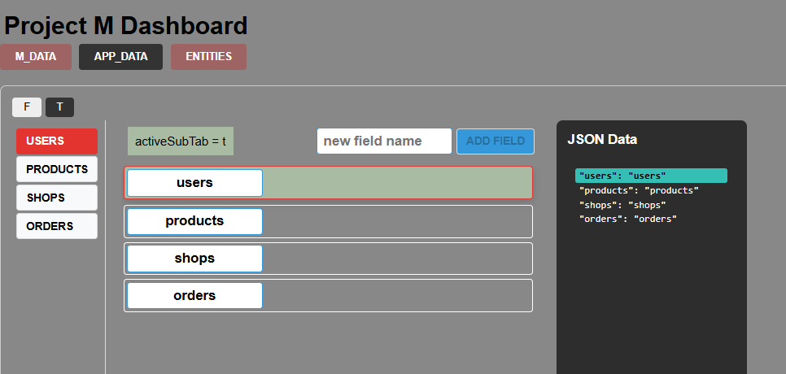
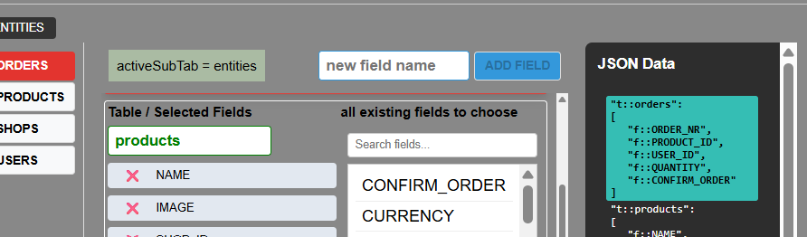

# TODO today

#### งานวันนี้

## บันทึกงานสำคัญสำหรับเริ่มต้นวันพรุ่งนี้

1.  (Add / Delete Table): เพิ่มฟังก์ชันสำหรับสร้าง (Add) และลบ (Delete) Table ใหม่ในส่วนของ Entities

2.  (Entities Tab)ฟังก์ชันสลับฟิลด์ (Add / Remove Fields):
    พัฒนาระบบให้สามารถคลิกเครื่องหมายกากบาท (X) ที่ฟิลด์ฝั่งซ้ายเพื่อนำฟิลด์ออกจาก
    Table และคลิกเลือกฟิลด์จากรายการ "all existing fields to choose" ฝั่งขวาเพื่อเพิ่มเข้ามาใน
    Table ได้อย่างอิสระจัดการตาราง

## GEMINI สรุป

1. Rename Table Names
    - พัฒนาระบบเปลี่ยนชื่อ Table ให้สามารถแก้ไขและบันทึกลง Backend ได้ทันทีแบบ Real-time โดยไม่ต้องกดปุ่ม Save แยกต่างหาก

    - รองรับการเปลี่ยนชื่อได้ทั้งจากส่วนของ App Data Sub-Tab (t) และในส่วนของหน้า Entities เพื่อความยืดหยุ่นในการใช้งาน

2. Entity CRUD & Field Management
    - จัดการระบบเลือกฟิลด์ซ้าย-ขวา โดยการคลิกนำฟิลด์เข้าออกระหว่าง Table/Selected Fields กับ All Existing Fields ให้สอดคล้องกับแต่ละ Table

    - เพิ่มความสามารถในการสร้าง (Add) และลบ (Delete) Table รวมถึงการจัดการข้อมูลในโครงสร้าง JSON ของ Entities ให้สมบูรณ์
