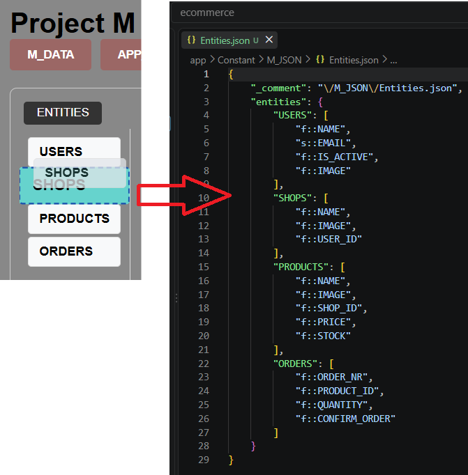

# TODO today

#### งานวันนี้

## automate all script

- run script 1 and 2
- stop script to ensure Entities.json and table order by User manuel action in UI or copy-paste Entities.json to target_app
- run scirpt 3 and 4

```php
//1. SCRIPT-run :
php App/Constant/2_M_Sync_JSON.php

to do this:
gen App/Constant/
...EntityConstant.php ,
...Constant_M.php ,
...Constant_APP.php,

//2. SCRIPT-run :
php App/Constant/1_M_Sync.php    // to save Entities order for Laravel migration

to do this:
gen App/Constant/M_JSON/Entities.json // IMPORTANT = order of laravel tables to migrate
gen App/Constant/M_JSON/App-Data.json // OPTIONAL = Archive of M-Project
gen App/Constant/M_JSON/M-Data.json // OPTIONAL = Archive of M-Project

//--- script Stop to ensure Entities.json , by user
// Hier Dev open M-Project UI to config M-Data.json , APP-Data.json and Entities.json
// User must make Order Entities in UI (per drag / drop)
// so that Laravel Migration run through correct of table order , makes no error "Foreign Key - table not found"


//3. SCRIPT-run :
php app/Constant/0_Runner_run.php

to do this: MakeMigration files and
php artisan migrate:fresh

//4. SCRIPT-run :
php app/Constant/3_EntityGenerator.php

to do this:
gen DTOs , Models , Controllers
```
