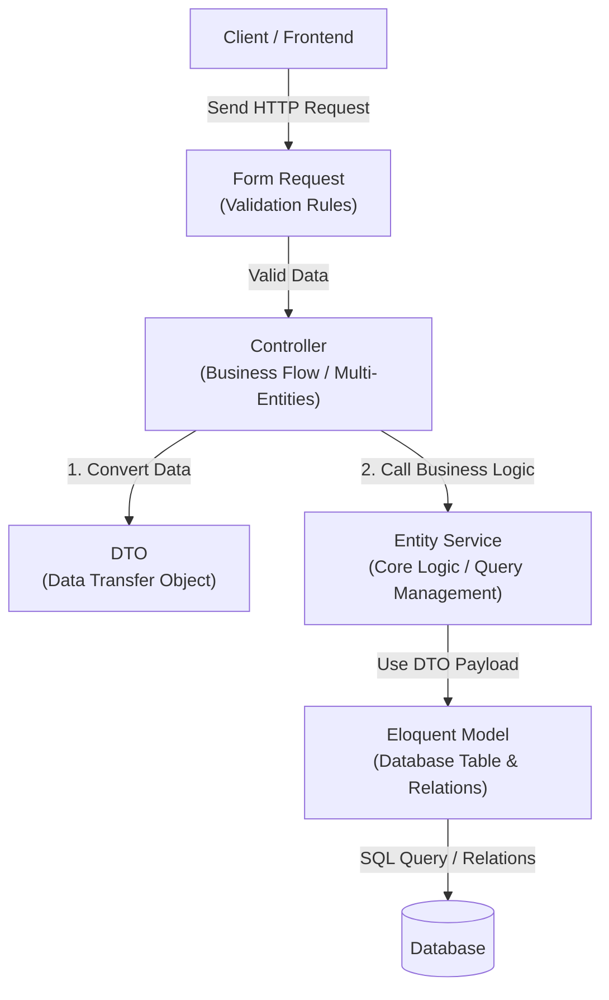

```mermaid
graph TD
    Client["Client / Frontend"] -->|Send HTTP Request| Request["Form Request<br/>(Validation Rules)"]

    Request -->|Valid Data| Controller["Controller<br/>(Business Flow / Multi-Entities)"]

    Controller -->|1. Convert Data| DTO["DTO<br/>(Data Transfer Object)"]
    Controller -->|2. Call Business Logic| Service["Entity Service<br/>(Core Logic / Query Management)"]

    Service -->|Use DTO Payload| Model["Eloquent Model<br/>(Database Table & Relations)"]

    Model -->|SQL Query / Relations| DB[(Database)]
```
