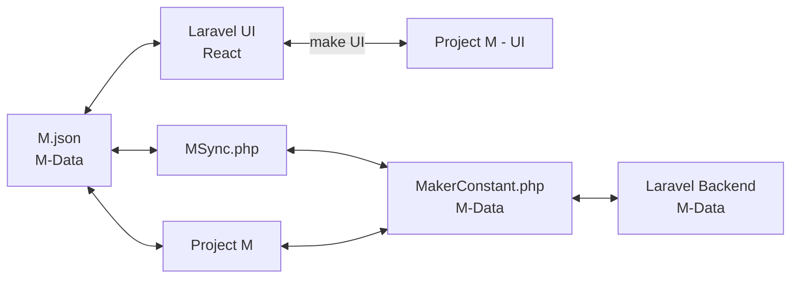

# Flow Project M

---

```mermaid
graph LR
    M[Project M]
    M-Sync[MSync.php]
    M-JSON[ M.json <br/> M-Data ]
    M-UI[ Project M - UI]
    UI[ Laravel UI <br /> React ]
    Maker[ MakerConstant.php <br/> M-Data ]
    Backend[Laravel Backend  <br/> M-Data ]

    M-JSON <--> M
    M-JSON <--> UI
    M-JSON <--> M-Sync
    M-Sync <--> Maker
    M <--> Maker
    Maker <--> Backend
    UI <-->|make UI| M-UI
```
