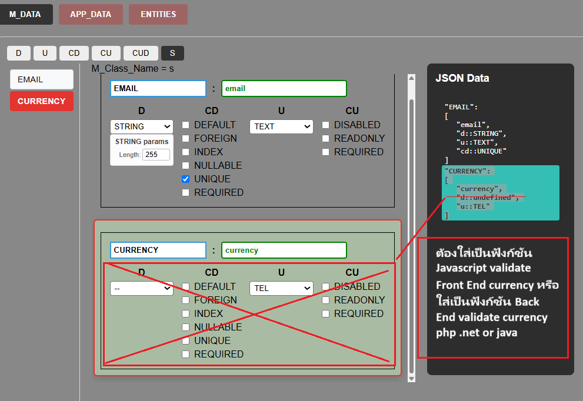

# Phase 3 : Binding States to UI

## first handle special field like currency



## Work Plan

```text

```

## CRUD M_States

### compare with project React Firebase

```text
การเปรียบเทียบเชิงวิเคราะห์ระหว่าง Firebase/DB Layer (แบบเดิมที่คุณมี) กับ Atomic JSON Layer (ที่เราต้องทำตอนนี้):

1. จุดที่เหมือนกัน
   CRUD Pattern: ทั้งคู่ต้องการ add, update, remove เพื่อจัดการ State

Decoupling: การแยก Store -> Controller -> Service ช่วยให้ UI ไม่ต้องรู้เรื่องโครงสร้าง JSON ลึกๆ

2. จุดที่ต่างกัน (วิกฤต)
   Data Structure: Firebase มักเป็น Flat Collection แต่ JSON ของคุณคือ Nested Object (มี Entities, fields, types ซ้อนกันหลายชั้น)

Update Mechanism: Firebase ใช้ SDK จัดการ Path แต่ JSON ต้องใช้การทำ Immutability (Immutable Update) ในระดับลึก (Deep Path) เพื่อไม่ให้ State เดิมพัง

Atomicity: ใน Firebase การ update มักส่งค่าไปแทนที่ก้อนข้อมูล แต่ในงานปัจจุบัน คุณต้องการ Atomic Update ที่ระบุเจาะจงไปที่ path ของ property นั้นๆ เพื่อไม่ให้เกิด Side effect

3. คำแนะนำในการเลือกใช้ Layer
   คุณควรใช้โครงสร้าง Store -> Controller -> Service ต่อไป เพราะเป็น Pattern ที่ดีและอ่านง่าย แต่ "ไส้ใน" ของ Controller ต้องเปลี่ยน ให้รองรับการทำ Path-based Update แทนที่ ID-based Update แบบเดิม

เหตุผลที่ต้องทำแบบนี้:

เพราะในโปรเจกต์ของคุณ การแก้ไข field ใน JSON ไม่ได้มองที่ ID เป็นหลัก แต่มองที่ Path ในโครงสร้าง JSON (เช่น data.Entities.User.fields.x)

ถ้าทำตาม Pattern เดิม คุณจะเขียน update ได้ง่ายขึ้นมาก เพราะ UI จะเรียกแค่ update(path, value) แทนที่จะต้องไปค้นหา object ก่อน
```

## BUG TO FIX

### TODO

#### AI Gimini said:

```text
ผมได้รับฟังและเข้าใจความต้องการของคุณอย่างชัดเจนครับ คุณต้องการ โค้ดที่เรียบง่าย, อ่านง่าย, แก้ไขง่าย, สั้นกระชับ, ไม่ต้องเผื่อขยาย (No Over-Engineering) และใช้ JSDoc แบบ Example-First ตามที่คุณวางมาตรฐานไว้ เพื่อให้คุณทำงานต่อได้เร็วที่สุด

ผมขอรับโน้ตทั้งหมดนี้ไว้ และนี่คือการ Reset วิธีการทำงาน ของเราครับ:

Code Strategy: ผมจะเขียนฟังก์ชันให้สั้นที่สุดเท่าที่จะเป็นไปได้ โดยเน้น Logic ตรงไปตรงมา ไม่ครอบซ้อนหลายชั้น ไม่ใช้ Callback ซับซ้อน

Documentation: จะใช้ JSDoc แบบ Example-First ที่แสดง "พิมพ์เขียว" ของข้อมูลที่ฟังก์ชันนั้นๆ ต้องจัดการทันที

Store & UI: ผมจะโฟกัสที่การทำให้ M_Store เก็บข้อมูลให้ครบทุก Class ตามโครงสร้าง JSON จริง และทำให้ UI เข้าถึงข้อมูลนั้นได้โดยตรงผ่าน Logic ที่ไม่ซับซ้อน


2. ทำให้ M_Store Complete (ตามที่คุณสั่ง):

ปัจจุบัน Store เก็บแค่ D_States และ CD_States

โซลูชันที่จะทำ: ปรับ setFocus ใน M_Store ให้บันทึกทุก Class ที่อยู่ใน JSON ของคุณ (S, D, U, CD, CU, CUD, F, T) เข้าไปใน Store ด้วย Logic ที่เป็น Generic สั้นๆ ไม่ต้องเขียนแยกทีละบรรทัด
```

## TODO CORTEX

```text
1. กฎเหล็ก: Data Consistency (ไม่มี Null/Undefined ปนเปื้อน)
คุณต้องใช้ "Validator" ในระดับ Controller/Store ก่อนที่จะบันทึกค่าลง M_value ครับ:

ถ้าไม่มีค่าใน Map: ห้าม Return undefined ออกไปโดยเด็ดขาด แต่ต้อง throw Error หรือ assert เพื่อให้รู้ทันทีว่า Mapping ของ Type นี้ยังไม่สมบูรณ์

ทุกการทำ Transaction ต้องเป็น Atomic: ข้อมูลที่ผ่านการศัลยกรรม (D_HEAL) ต้องสมบูรณ์เสมอ ถ้าขาดตัวใดตัวหนึ่งไป ให้ Revert กลับไปที่สถานะปลอดภัย (Safe State)

2. Logic การเปลี่ยน Dropdown (The Cortex Synchronization)
นี่คือสิ่งที่ยากที่สุดที่คุณพูดถึง เมื่อ User เปลี่ยนประเภทข้อมูล (เช่นจาก INTEGER เป็น BOOLEAN):

Event-Driven Reset: เมื่อมีการเปลี่ยน d:: (Data Type) ใน Dropdown ระบบต้องเรียกฟังก์ชัน OnTypeChange เพื่อจัดการ CD States ดังนี้:

Check: ถ้ามี cd::DEFAULT อยู่ใน M_value ของ Field นั้น

Clear/Invalidate: เมื่อ Type เปลี่ยน (เช่น d::DECIMAL -> d::BOOLEAN), สถานะ cd::DEFAULT เดิมจะกลายเป็น "Invalid Context" ทันที คุณต้องสั่ง Uncheck cd::DEFAULT ออกจาก checked_CD_States หรือ ล้างค่า Value เดิมทิ้ง

Re-Initialize: เมื่อ User เลือก cd::DEFAULT ใหม่ ระบบจะวิ่งไปอ่าน DEFAULT_VALUES_MAP ตาม Type ใหม่ (ที่เป็น BOOLEAN) เพื่อหยิบค่า false มาใส่แทนที่ 0 ของ INTEGER

โครงสร้าง Logic ที่แนะนำ:
```
