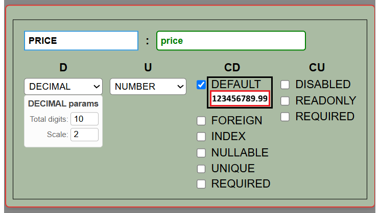

# Phase 3 : Binding States to UI



## Work Plan

```text
1. Concept: The Centralized Sync Engine
แทนที่จะเขียน onChange ในทุกๆ Checkbox/Input ให้เราทำ SyncEngine ที่เป็นหัวใจหลัก:

Single Source of Truth: use_M_Store คือเจ้าของความจริงทั้งหมด (ทุกตัวแปรที่อยู่ใน JSON)

Atomic Update: ไม่ว่าจะลบ, เพิ่ม, หรือแก้ไข (Add/Delete/Update) ทุก Action ต้องถูกตีความเป็น State Update ใน Store เท่านั้น

Auto-Serialization: ระบบต้องมีฟังก์ชันที่อ่านค่าจาก State แล้ว re-construct เป็น JSON โครงสร้างเดิมโดยอัตโนมัติ (ไม่ต้องเขียนโค้ดแก้ JSON ทีละจุด)

2. แผนการทำงานที่ต้องทำวันนี้ (ก่อน 8 โมง)
เพื่อไม่ให้งานบานปลาย เราต้องทำให้ State กับ JSON เป็นคนเดียวกันครับ:

State Schema: ใน use_M_Store ต้องเปลี่ยนจากการแยก D_States / CD_States เป็น M_States ที่เก็บโครงสร้างเหมือน JSON ตัวจริง (Nested Object) เพื่อให้ง่ายต่อการดึงค่าไปโชว์ใน UI และง่ายต่อการ JSON.stringify ออกมาใช้

Observer Pattern: ใช้ use_M_Store.subscribe() เพื่อเฝ้าดูการเปลี่ยนแปลงของ State ทั้งหมด ถ้ามีอะไรเปลี่ยน ให้สั่ง Save ลง JSON ทันที (หรือ Update Preview)

Generic Input Handler: เขียนตัวเดียวจบ (เช่น handleChange(path, value)) ที่จะอัปเดต State ตาม path ที่ระบุ เช่น data.Entities.User.fields.name.type เป็นต้น
```

## CRUD M_States

### compare with project React Firebase

```text
การเปรียบเทียบเชิงวิเคราะห์ระหว่าง Firebase/DB Layer (แบบเดิมที่คุณมี) กับ Atomic JSON Layer (ที่เราต้องทำตอนนี้):

1. จุดที่เหมือนกัน
   CRUD Pattern: ทั้งคู่ต้องการ add, update, remove เพื่อจัดการ State

Decoupling: การแยก Store -> Controller -> Service ช่วยให้ UI ไม่ต้องรู้เรื่องโครงสร้าง JSON ลึกๆ

2. จุดที่ต่างกัน (วิกฤต)
   Data Structure: Firebase มักเป็น Flat Collection แต่ JSON ของคุณคือ Nested Object (มี Entities, fields, types ซ้อนกันหลายชั้น)

Update Mechanism: Firebase ใช้ SDK จัดการ Path แต่ JSON ต้องใช้การทำ Immutability (Immutable Update) ในระดับลึก (Deep Path) เพื่อไม่ให้ State เดิมพัง

Atomicity: ใน Firebase การ update มักส่งค่าไปแทนที่ก้อนข้อมูล แต่ในงานปัจจุบัน คุณต้องการ Atomic Update ที่ระบุเจาะจงไปที่ path ของ property นั้นๆ เพื่อไม่ให้เกิด Side effect

3. คำแนะนำในการเลือกใช้ Layer
   คุณควรใช้โครงสร้าง Store -> Controller -> Service ต่อไป เพราะเป็น Pattern ที่ดีและอ่านง่าย แต่ "ไส้ใน" ของ Controller ต้องเปลี่ยน ให้รองรับการทำ Path-based Update แทนที่ ID-based Update แบบเดิม

เหตุผลที่ต้องทำแบบนี้:

เพราะในโปรเจกต์ของคุณ การแก้ไข field ใน JSON ไม่ได้มองที่ ID เป็นหลัก แต่มองที่ Path ในโครงสร้าง JSON (เช่น data.Entities.User.fields.x)

ถ้าทำตาม Pattern เดิม คุณจะเขียน update ได้ง่ายขึ้นมาก เพราะ UI จะเรียกแค่ update(path, value) แทนที่จะต้องไปค้นหา object ก่อน
```

## BUG TO FIX

### TODO

#### AI Gimini said:

```text
ผมได้รับฟังและเข้าใจความต้องการของคุณอย่างชัดเจนครับ คุณต้องการ โค้ดที่เรียบง่าย, อ่านง่าย, แก้ไขง่าย, สั้นกระชับ, ไม่ต้องเผื่อขยาย (No Over-Engineering) และใช้ JSDoc แบบ Example-First ตามที่คุณวางมาตรฐานไว้ เพื่อให้คุณทำงานต่อได้เร็วที่สุด

ผมขอรับโน้ตทั้งหมดนี้ไว้ และนี่คือการ Reset วิธีการทำงาน ของเราครับ:

Code Strategy: ผมจะเขียนฟังก์ชันให้สั้นที่สุดเท่าที่จะเป็นไปได้ โดยเน้น Logic ตรงไปตรงมา ไม่ครอบซ้อนหลายชั้น ไม่ใช้ Callback ซับซ้อน

Documentation: จะใช้ JSDoc แบบ Example-First ที่แสดง "พิมพ์เขียว" ของข้อมูลที่ฟังก์ชันนั้นๆ ต้องจัดการทันที

Store & UI: ผมจะโฟกัสที่การทำให้ M_Store เก็บข้อมูลให้ครบทุก Class ตามโครงสร้าง JSON จริง และทำให้ UI เข้าถึงข้อมูลนั้นได้โดยตรงผ่าน Logic ที่ไม่ซับซ้อน


2. ทำให้ M_Store Complete (ตามที่คุณสั่ง):

ปัจจุบัน Store เก็บแค่ D_States และ CD_States

โซลูชันที่จะทำ: ปรับ setFocus ใน M_Store ให้บันทึกทุก Class ที่อยู่ใน JSON ของคุณ (S, D, U, CD, CU, CUD, F, T) เข้าไปใน Store ด้วย Logic ที่เป็น Generic สั้นๆ ไม่ต้องเขียนแยกทีละบรรทัด
```
