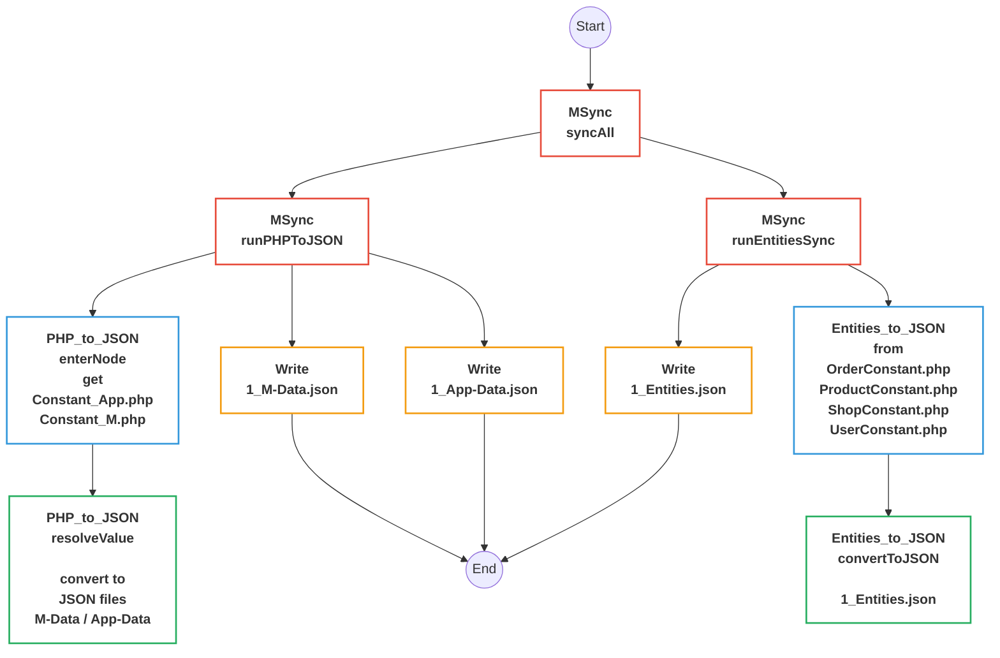

# Flow MSync.php

```mermaid
graph TD
    %% Define Styles
    classDef mainCall stroke:#e74c3c,stroke-width:2px,font-weight:bold,fill:none;
    classDef visitorCall stroke:#3498db,stroke-width:2px,font-weight:bold,fill:none;
    classDef helperCall stroke:#27ae60,stroke-width:2px,font-weight:bold,fill:none;
    classDef fileCall stroke:#f39c12,stroke-width:2px,font-weight:bold,fill:none;

    %% Entry Point
    Start((Start)) --> MSync_syncAll[MSync<br/>syncAll]:::mainCall

    %% MSync Phase
    MSync_syncAll --> MSync_runPHP[
                                    MSync
                                    runPHPToJSON
                                ]:::mainCall

    MSync_syncAll --> MSync_runEntities[
                                        MSync
                                        runEntitiesSync
                                    ]:::mainCall

    %% PHP_to_JSON Path (M-Data & App-Data)

    MSync_runPHP --> Extract_PHP[
                                    PHP_to_JSON
                                    enterNode
                                       get
                                    Constant_App.php
                                    Constant_M.php

                                ]:::visitorCall

    Extract_PHP --> Convert_PHP[
                                    PHP_to_JSON
                                    resolveValue

                                    convert to
                                    JSON files
                                    M-Data / App-Data

                                ]:::helperCall

    MSync_runPHP --> Write_M[
                                Write
                                1_M-Data.json
                            ]:::fileCall

    MSync_runPHP --> Write_App[
                                Write
                                1_App-Data.json
                            ]:::fileCall

    %% Entities_to_JSON Path

    MSync_runEntities --> Extract_Ent[
                                        Entities_to_JSON
                                            from
                                        OrderConstant.php
                                        ProductConstant.php
                                        ShopConstant.php
                                        UserConstant.php
                                ]:::visitorCall

    Extract_Ent --> Convert_Ent[
                                    Entities_to_JSON
                                    convertToJSON

                                    1_Entities.json
                                ]:::helperCall

    MSync_runEntities --> Write_Ent[
                                    Write
                                    1_Entities.json
                                ]:::fileCall

    %% Final End
    Write_M --> End((End))
    Write_App --> End
    Write_Ent --> End
```
