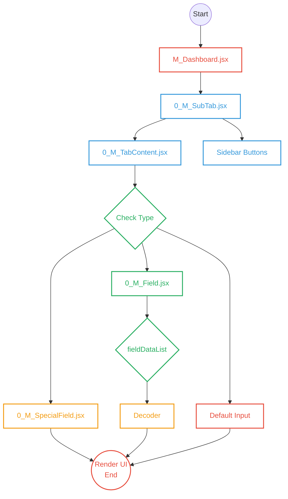

# Flow M_UI

```mermaid
graph TD
    %% Define Styles - ไม่มีพื้นหลัง, เส้นขอบและสีตาม Convention เดิม
    classDef mainNode stroke:#e74c3c,stroke-width:2px,color:#e74c3c,fill:none;
    classDef subNode stroke:#3498db,stroke-width:2px,color:#3498db,fill:none;
    classDef logicNode stroke:#27ae60,stroke-width:2px,color:#27ae60,fill:none;
    classDef handlerNode stroke:#f39c12,stroke-width:2px,color:#f39c12,fill:none;

    %% Flow Structure
    Start((Start)) --> M_Dashboard[M_Dashboard.jsx]:::mainNode

    M_Dashboard --> SubTab[0_M_SubTab.jsx]:::subNode

    SubTab --> TabContent[0_M_TabContent.jsx]:::subNode
    SubTab --> SidebarButtons[Sidebar Buttons]:::subNode

    TabContent --> CheckType{Check Type}:::logicNode

    CheckType --> SpecialField[0_M_SpecialField.jsx]:::handlerNode
    CheckType --> Field[0_M_Field.jsx]:::logicNode
    CheckType --> DefaultInput[Default Input]:::mainNode

    Field --> fieldDataList{fieldDataList}:::logicNode
    fieldDataList --> Decoder[Decoder]:::handlerNode

    SpecialField --> Render((Render UI <br /> End)):::mainNode
    Decoder --> Render
    DefaultInput --> Render
```
