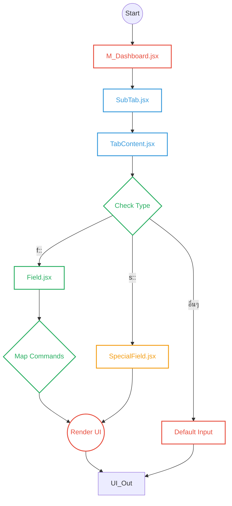

# Flow M_UI

```mermaid
graph TD
    %% Define Styles - ไม่มีสีพื้นหลัง, เน้นสีเส้นขอบและตัวอักษร
    classDef mainNode stroke:#e74c3c,stroke-width:2px,color:#e74c3c,fill:none;
    classDef subNode stroke:#3498db,stroke-width:2px,color:#3498db,fill:none;
    classDef logicNode stroke:#27ae60,stroke-width:2px,color:#27ae60,fill:none;
    classDef handlerNode stroke:#f39c12,stroke-width:2px,color:#f39c12,fill:none;

    %% Flow Structure
    Start((Start)) --> M_Dashboard[M_Dashboard.jsx]:::mainNode

    M_Dashboard --> SubTab[SubTab.jsx]:::subNode
    SubTab --> TabContent[TabContent.jsx]:::subNode

    %% Dispatcher Logic
    TabContent --> CheckClass{Check Type}:::logicNode

    CheckClass -- "s::" --> SpecialField[SpecialField.jsx]:::handlerNode
    CheckClass -- "f::" --> Field[Field.jsx]:::logicNode
    CheckClass -- "อื่นๆ" --> DefaultInput[Default Input]:::mainNode

    %% Decoder Logic
    Field --> Commands{Map Commands}:::logicNode
    Commands --> Decoder[Decoder]:::handlerNode

    %% Final Rendering
    SpecialField --> Decoder((Render UI)):::mainNode
    Decoder --> UI_Out
    DefaultInput --> UI_Out
```
