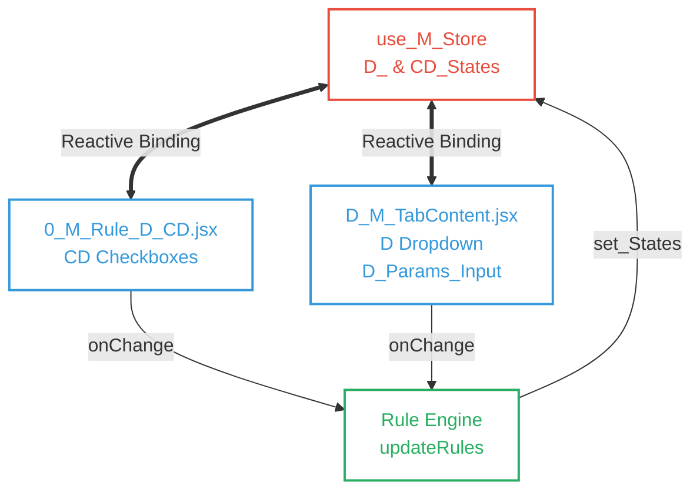

# Flow States Binding

```mermaid
graph TD
    %% Define Styles
    classDef storeNode stroke:#e74c3c,stroke-width:2px,color:#e74c3c,fill:none;
    classDef uiNode stroke:#3498db,stroke-width:2px,color:#3498db,fill:none;
    classDef logicNode stroke:#27ae60,stroke-width:2px,color:#27ae60,fill:none;

    %% Components
    Store[
            use_M_Store
            D_ & CD_States
         ]:::storeNode

    UI_Checkbox[
                 0_M_Rule_D_CD.jsx
                 CD Checkboxes
                ]:::uiNode

    UI_Dropdown[
                 D_M_TabContent.jsx
                 D Dropdown
                 D_Params_Input
                ]:::uiNode

    RuleEngine[
                Rule Engine
                updateRules
              ]:::logicNode

    %% Binding
    Store <==>|Reactive Binding| UI_Checkbox
    Store <==>|Reactive Binding| UI_Dropdown

    UI_Checkbox -->|onChange| RuleEngine
    UI_Dropdown -->|onChange| RuleEngine

    RuleEngine -->|set_States| Store

```
