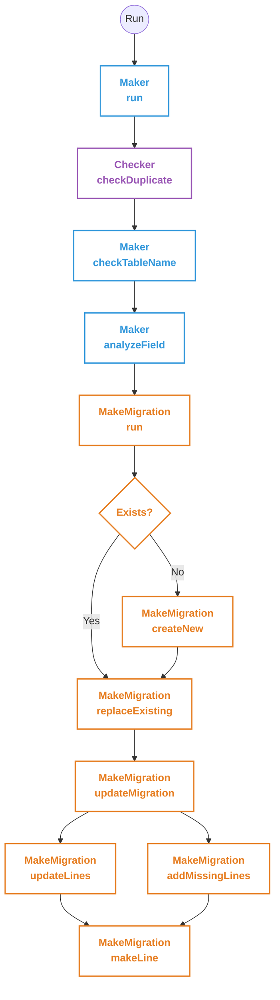

# PHP - Flow

```mermaid
graph TD
    %% กำหนดสไตล์ Minimalist
    classDef makerClass stroke:#3498db,stroke-width:2px,color:#3498db,font-weight:bold,fill:none;
    classDef makeMigClass stroke:#e67e22,stroke-width:2px,color:#e67e22,font-weight:bold,fill:none;
    classDef checkClass stroke:#9b59b6,stroke-width:2px,color:#9b59b6,font-weight:bold,fill:none;

    %% ฟังก์ชันของ Maker
    Maker_Run[Maker<br/>run]:::makerClass
    Maker_CheckTableName[Maker<br/>checkTableName]:::makerClass
    Maker_AnalyzeField[Maker<br/>analyzeField]:::makerClass

    %% ฟังก์ชันของ MakeMigration
    MakeMigration_Run[MakeMigration<br/>run]:::makeMigClass
    MakeMigration_ReplaceExisting{Exists?}:::makeMigClass
    MakeMigration_ReplaceExisting_Func[MakeMigration<br/>replaceExisting]:::makeMigClass
    MakeMigration_CreateNew[MakeMigration<br/>createNew]:::makeMigClass
    MakeMigration_UpdateMigration[MakeMigration<br/>updateMigration]:::makeMigClass
    MakeMigration_UpdateLines[MakeMigration<br/>updateLines]:::makeMigClass
    MakeMigration_AddMissingLines[MakeMigration<br/>addMissingLines]:::makeMigClass
    MakeMigration_MakeLine[MakeMigration<br/>makeLine]:::makeMigClass

    %% ฟังก์ชันของ Checker
    Checker_CheckDuplicate[Checker<br/>checkDuplicate]:::checkClass

    %% Flow การทำงาน
    Start((Run)) --> Maker_Run
    Maker_Run --> Checker_CheckDuplicate
    Checker_CheckDuplicate --> Maker_CheckTableName
    Maker_CheckTableName --> Maker_AnalyzeField
    Maker_AnalyzeField --> MakeMigration_Run

    MakeMigration_Run --> MakeMigration_ReplaceExisting
    MakeMigration_ReplaceExisting -- Yes --> MakeMigration_ReplaceExisting_Func
    MakeMigration_ReplaceExisting -- No --> MakeMigration_CreateNew

    MakeMigration_ReplaceExisting_Func --> MakeMigration_UpdateMigration
    MakeMigration_UpdateMigration --> MakeMigration_UpdateLines
    MakeMigration_UpdateMigration --> MakeMigration_AddMissingLines

    MakeMigration_UpdateLines --> MakeMigration_MakeLine
    MakeMigration_AddMissingLines --> MakeMigration_MakeLine

    MakeMigration_CreateNew --> MakeMigration_ReplaceExisting_Func
```
