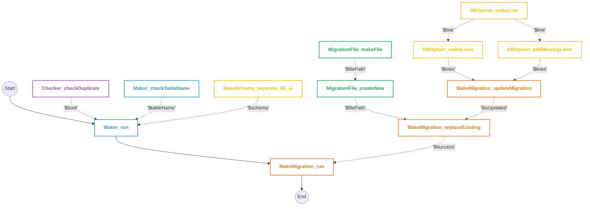

# PHP - Flow

```mermaid
graph TD
    %% Define Styles
    classDef makerClass stroke:#3498db,stroke-width:2px,color:#3498db,font-weight:bold,fill:none;
    classDef makeMigClass stroke:#e67e22,stroke-width:2px,color:#e67e22,font-weight:bold,fill:none;
    classDef checkClass stroke:#9b59b6,stroke-width:2px,color:#9b59b6,font-weight:bold,fill:none;
    classDef fileClass stroke:#27ae60,stroke-width:2px,color:#27ae60,font-weight:bold,fill:none;
    classDef schemaClass stroke:#f1c40f,stroke-width:2px,color:#f1c40f,font-weight:bold,fill:none;

    %% Nodes
    Maker_Run[Maker_run]:::makerClass
    Maker_Check[Maker_checkTableName]:::makerClass
    Checker_Run[Checker_checkDuplicate]:::checkClass
    MakeSchema_Sep[MakeSchema_separate_db_ui]:::schemaClass

    MakeMig_Run[MakeMigration_run]:::makeMigClass
    MakeMig_Replace[MakeMigration_replaceExisting]:::makeMigClass
    MakeMig_Update[MakeMigration_updateMigration]:::makeMigClass

    DBOpt_MakeLines[DBOption_makeLines]:::schemaClass
    DBOpt_MakeLine[DBOption_makeLine]:::schemaClass
    DBOpt_AddMissing[DBOption_addMissingLines]:::schemaClass

    MigFile_Create[MigrationFile_createNew]:::fileClass
    MigFile_Make[MigrationFile_makeFile]:::fileClass

    %% Main Start
    Start((Start)) --> Maker_Run

Maker_Run --> MakeMig_Run

    %% Return Data Flow
    Checker_Run -.->|'$bool'| Maker_Run
    Maker_Check -.->|'$tableName'| Maker_Run
    MakeSchema_Sep -.->|'$schema'| Maker_Run

    MigFile_Make -.->|'$filePath'| MigFile_Create
    MigFile_Create -.->|'$filePath'| MakeMig_Replace

    DBOpt_MakeLine -.->|'$line'| DBOpt_MakeLines
    DBOpt_MakeLine -.->|'$line'| DBOpt_AddMissing

    DBOpt_MakeLines -.->|'$lines'| MakeMig_Update
    DBOpt_AddMissing -.->|'$lines'| MakeMig_Update
    MakeMig_Update -.->|'$isUpdated'| MakeMig_Replace

    MakeMig_Replace -.->|'$success'| MakeMig_Run

    %% Final End
    MakeMig_Run --> End((End))
```
