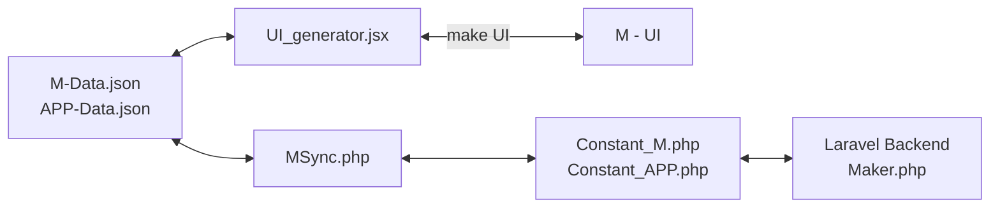

# Project M

## M-Data Flow

### React-Laravel

```mermaid
graph LR
    M-Sync[MSync.php]
    M-JSON[
            M-Data.json
            APP-Data.json
          ]
    M-UI[ M - UI]
    UI[ UI_generator.jsx ]
    Maker[
            Constant_M.php
            Constant_APP.php
         ]
    Backend[
            Laravel Backend
            Maker.php
           ]

    M-JSON <--> UI
    M-JSON <--> M-Sync
    M-Sync <--> Maker
    Maker <--> Backend
    UI <-->|make UI| M-UI
```
