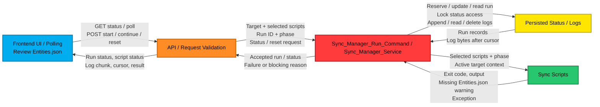
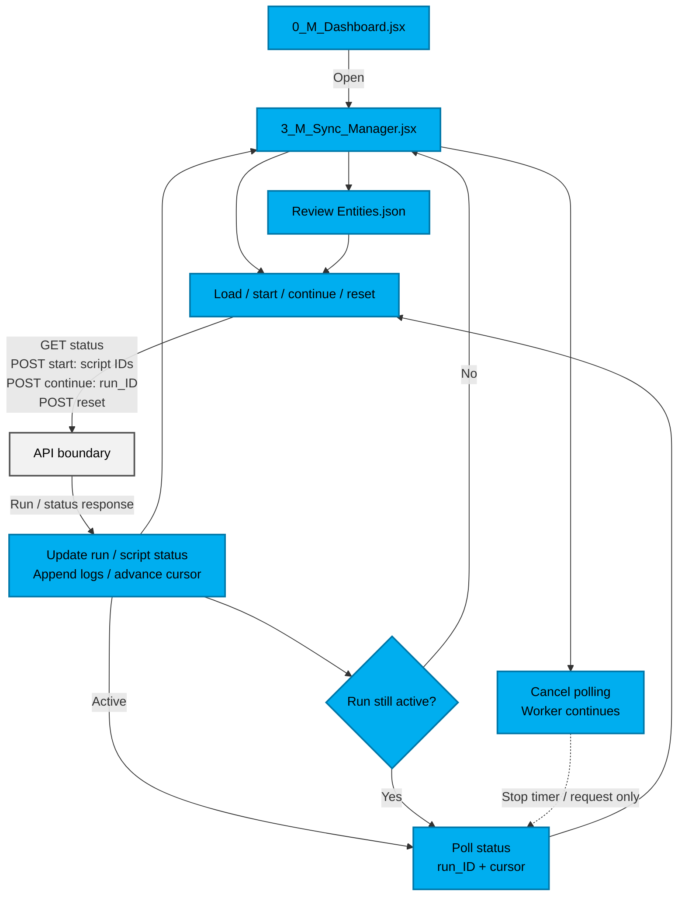
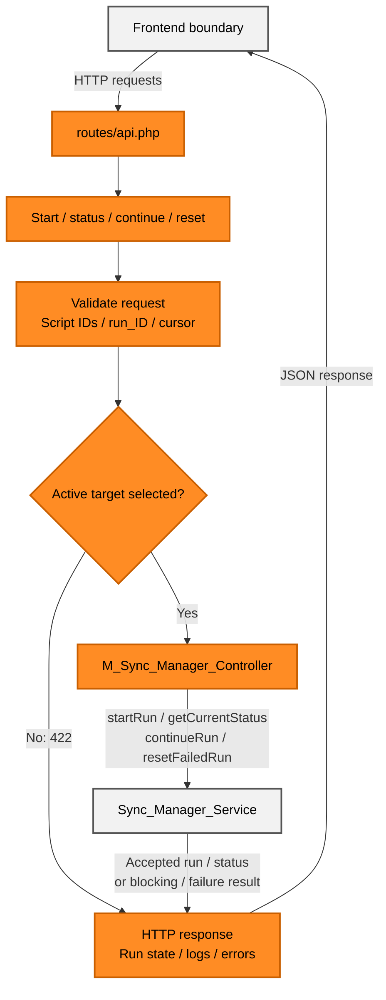
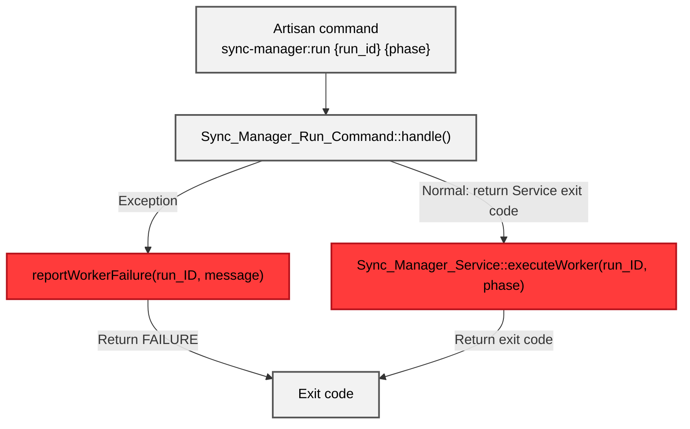
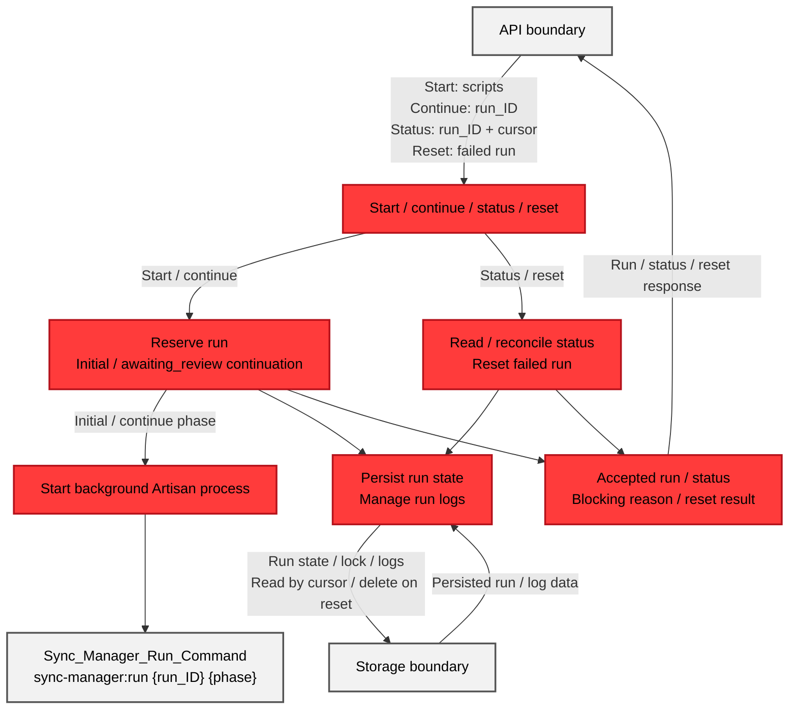
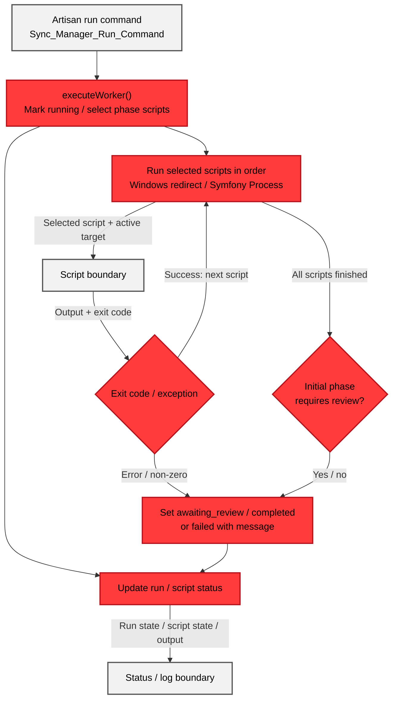
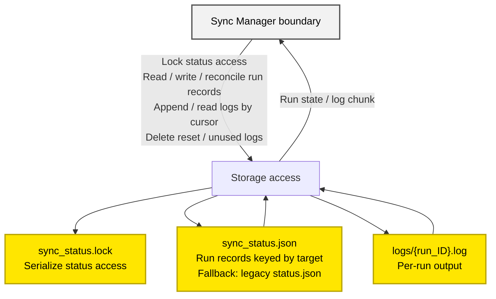
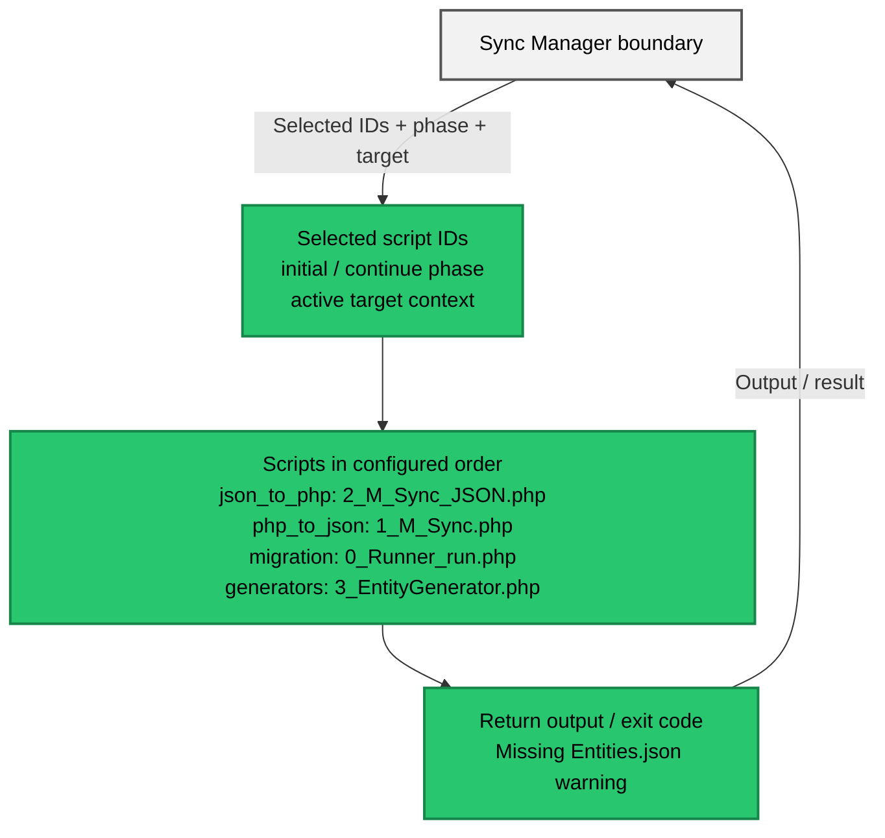

# Flow_Sync_Manager

## System Overview



## Diagram Details

### Frontend UI / Polling

<div className="sync-manager-flow-section">
<div className="sync-manager-flow-description">

<strong className="sync-manager-flow-summary">0_M_Dashboard.jsx →<br />3_M_Sync_Manager.jsx</strong>

Open the modal, choose scripts, and display run state and output.

<strong className="sync-manager-flow-summary">Poll status →<br />request new log bytes</strong>

```javascript
const query = new URLSearchParams({
    run_id: run_ID,
    cursor: String(log_Cursor.current),
});
const response = await fetch(
    `${sync_Manager_Api_Path}/status?${query.toString()}`,
);
const response_Data = await response.json();

append_Run_Logs(response_Data.logs || "");
log_Cursor.current = response_Data.cursor || log_Cursor.current;
```

**Each response updates run/script status** , <br /> **appends the new log text** , <br />and **saves the next byte** `cursor` 
```text
# cursor = position to read next in the log file
[12:00:00] เริ่มงาน\n
[12:00:02] สร้างไฟล์สำเร็จ\n
```
So the next poll does not fetch old log lines again. <br />
**While the run is active** , **the poll function schedules itself** again:

```javascript
if (active_Run_Statuses.includes(response_Data.status)) {
    poll_Timer = window.setTimeout(poll_Run_Status, POLLING_INTERVAL_MS);
}
```

This stops naturally when the run reaches a terminal status. **Cancel polling** sets `is_Polling` to false; effect cleanup clears the timer and aborts the current request, but does not stop the backend run.

<strong className="sync-manager-flow-summary">Start →<br />send selected script IDs</strong>

```javascript
body: JSON.stringify({ scripts: selected_Scripts })
```

<strong className="sync-manager-flow-summary">Review Entities.json →<br />continue generation scripts</strong>

When sync and generation scripts are both selected, the run pauses after sync. Check the entity/table master order in `Entities.json`; it is preserved for dependency-sensitive migration order. Then choose Continue:

```javascript
fetch(`${sync_Manager_Api_Path}/${encodeURIComponent(run_ID)}/continue`, { method: "POST" });
```

</div>
<div className="sync-manager-flow-diagram">



</div>
</div>

### API / Request Validation

<div className="sync-manager-flow-section">
<div className="sync-manager-flow-description">

<strong className="sync-manager-flow-summary">routes/api.php →<br />M_Sync_Manager_Controller</strong>

Routes connect each HTTP request to its controller action.

```php
Route::post('/sync-manager/start', [M_Sync_Manager_Controller::class, 'start']);
Route::get('/sync-manager/status', [M_Sync_Manager_Controller::class, 'status']);
Route::post('/sync-manager/reset', [M_Sync_Manager_Controller::class, 'resetFailedRun']);
Route::post('/sync-manager/{run_ID}/continue', [M_Sync_Manager_Controller::class, 'continueRun']);
```

<strong className="sync-manager-flow-summary">Start request →<br />allowlisted scripts</strong>

```php
$validated = $request->validate([
    'scripts' => 'required|array|min:1',
    'scripts.*' => [
        'required',
        'string',
        Rule::in(Sync_Manager_Service::SCRIPT_IDS),
    ],
]);
```

Example payload: `{"scripts":["json_to_php"]}`

<strong className="sync-manager-flow-summary">Controller →<br />check target, call Service, map result to HTTP</strong>

The controller handles HTTP input and response rules. It rejects a missing target before starting a run, then passes validated script IDs to the Service.

```php
if (TargetManager::get_activeTarget() === '') {
    return response()->json([
        'success' => false,
        'message' => 'Select an active target before starting Sync Manager.',
    ], 422);
}

$result = $this->sync_Manager_Service->startRun($validated['scripts']);
```

The Service returns `accepted` and the run record. The controller maps accepted runs to `202`, conflicts to `409`, and failed runs to `500`.

```php
return response()->json([
    'success' => true,
    'run' => $result['run'],
], 202);
```

<strong className="sync-manager-flow-summary">Service →<br />own the run lifecycle</strong>

The Service resolves the active target, orders scripts, reserves and persists the run, then launches the detached worker. It returns the run result; it does not build an HTTP response.

```php
$target_Name = $this->get_Active_Target_Name();
$ordered_Scripts = $this->order_Selected_Scripts($selected_Scripts);
$run_Record = $this->reserve_Run($target_Name, $ordered_Scripts);

if (!$run_Record['accepted']) {
    return $run_Record;
}

return $this->launch_Reserved_Run(
    $target_Name,
    $run_Record['run'],
    self::PHASE_INITIAL
);
```

<strong className="sync-manager-flow-summary">Responsibility split</strong>

- **Controller — HTTP boundary:** <br />
validates input and maps results to HTTP; e.g. missing target → `422`, accepted run → `202`, conflict → `409`.
- **Service — run coordination:** <br />
owns the run state and the work behind each request:
  - **Target/run state:** associates a run with its active target and tracks statuses such as `starting` and `running`.
  - **Locking:** uses `sync_status.lock` to prevent overlapping status-file access.
  - **Persistence:** saves run state in `sync_status.json` and script output in that run's log.
  - **Background command:** launches the detached Artisan command; the command forwards `run_id` and `phase` to the Service method that executes scripts.

<strong className="sync-manager-flow-summary">Artisan command handoff</strong>

- **Command:** [Artisan handler](https://github.com/softwaretotest/m-project/blob/main/app/Constant/3_M_Sync_Manager_Run_Command.php#L17-L29) receives `run_id` and `phase`.
- **Service:** the handler calls [`executeWorker()`](https://github.com/softwaretotest/m-project/blob/main/app/Constant/3_M_Sync_Manager_Service.php#L233), which runs the phase scripts and records their results.
</div>
<div className="sync-manager-flow-diagram">



</div>
</div>

### Sync_Manager_Run_Command

<div className="sync-manager-flow-section">
<div className="sync-manager-flow-description">

<strong className="sync-manager-flow-summary">Receive run_ID + phase →<br />
call Sync_Manager_Service →<br />
return exit code</strong>

`Sync_Manager_Run_Command` is the Artisan entry point for the detached command. It does not reserve runs or execute the scripts itself; `handle()` passes `run_id` and `phase` to the Service.

```php
return $sync_Manager_Service->executeWorker(
    $run_ID,
    (string) $this->argument('phase')
);
```

If the Service throws, the command calls `reportWorkerFailure()` and returns a failure exit code.

```text
catch → reportWorkerFailure(run_ID, message) → FAILURE
```

</div>
<div className="sync-manager-flow-diagram">



</div>
</div>

### Sync_Manager_Service / Run Control

<div className="sync-manager-flow-section">
<div className="sync-manager-flow-description">

<strong className="sync-manager-flow-summary">Order selected scripts →<br />
reserve run → persist state →<br />
launch command</strong>

`startRun()` reserves one run for the active target and saves the phase split. <br />
It then starts a separate PHP/Artisan process; <br />
this is a backend command, not another API request. <br />
The HTTP request can return `202` while that process continues running the scripts.

```text
php artisan sync-manager:run <run_id> <phase>
```

On Windows, the Service starts this command with `start "" /B` so it is detached from the HTTP request and can keep running after the response is sent.

**Stored run record (selected fields)**

```php
$run_Record = [
    'run_id' => $run_ID,
    'status' => self::STATUS_STARTING,
    'initial_scripts' => $initial_Scripts,
    'final_scripts' => $final_Scripts,
    'requires_review' => $requires_Review,
];
```

**Dead process:** if a persisted run says `running` but its process is gone, `reconcile_Dead_Process()` changes the run to `failed` so it no longer blocks a new run.

</div>
<div className="sync-manager-flow-diagram">



</div>
</div>

### Sync_Manager_Service / Script Execution

<div className="sync-manager-flow-section">
<div className="sync-manager-flow-description">

<strong className="sync-manager-flow-summary">executeWorker() →<br />select phase scripts →<br />record results</strong>

```php
$script_IDs = $phase === self::PHASE_CONTINUE
    ? $run_Record['final_scripts']
    : $run_Record['initial_scripts'];

$current_Run['status'] = self::STATUS_RUNNING;
```

**Run selected scripts in order**

The Service takes the script IDs saved in the run record and executes them one at a time. For each script it calls `execute_Script()` with the run's target, then checks the returned exit code before moving to the next script. The script output is appended to that run's log.

```php
foreach ($script_IDs as $script_ID) {
    $this->update_Script_Status($target_Name, $run_ID, $script_ID, self::STATUS_RUNNING);
    $this->append_Run_Output($run_ID, "[[M_SYNC_SCRIPT_START:{$script_ID}]]" . PHP_EOL);

    try {
        $script_Result = $this->execute_Script($run_Record, $script_ID);
    } catch (Throwable $exception) {
        $this->update_Script_Status($target_Name, $run_ID, $script_ID, self::STATUS_FAILED);
        $this->fail_Run($target_Name, $run_ID, $exception->getMessage());

        return 1;
    } finally {
        $this->append_Run_Output($run_ID, "[[M_SYNC_SCRIPT_END:{$script_ID}]]" . PHP_EOL);
    }

    if ($script_Result['exit_code'] !== 0) {
        $this->update_Script_Status($target_Name, $run_ID, $script_ID, self::STATUS_FAILED);
        $this->fail_Run(
            $target_Name,
            $run_ID,
            "Script '{$script_ID}' exited with code {$script_Result['exit_code']}"
        );

        return $script_Result['exit_code'];
    }

    $script_Status = $script_ID === self::SCRIPT_JSON_TO_PHP && $script_Result['has_missing_entities_json']
        ? self::SCRIPT_STATUS_WARNING
        : self::STATUS_COMPLETED;
    $this->update_Script_Status($target_Name, $run_ID, $script_ID, $script_Status);
}
```

**Set awaiting_review / completed / failed**

After the scripts finish, the Service chooses the run's final state. <br /> 
A mixed sync + generation run pauses at `awaiting_review`; <br /> 
otherwise it becomes `completed`. <br /> 
An exception or non-zero exit code marks it `failed` with a message.

```php
if ($phase === self::PHASE_INITIAL && $run_Record['requires_review']) {
    $this->update_Run($target_Name, $run_ID, function (array $current_Run): array {
        $current_Run['status'] = self::STATUS_AWAITING_REVIEW;
        $current_Run['pid'] = null;
        $current_Run['message'] = 'Review Entities.json, then continue the selected generation scripts.';
        $current_Run['updated_at'] = date(DATE_ATOM);

        return $current_Run;
    });

    return 0;
}

$this->update_Run($target_Name, $run_ID, function (array $current_Run): array {
    $current_Run['status'] = self::STATUS_COMPLETED;
    $current_Run['pid'] = null;
    $current_Run['finished_at'] = date(DATE_ATOM);
    $current_Run['updated_at'] = date(DATE_ATOM);

    return $current_Run;
});
```

**Update run / script status**

```php
private function update_Script_Status(
    string $target_Name,
    string $run_ID,
    string $script_ID,
    string $script_Status
): void {
    $this->update_Run($target_Name, $run_ID, function (array $run_Record) use ($script_ID, $script_Status): array {
        $run_Record['script_statuses'][$script_ID] = $script_Status;
        $run_Record['updated_at'] = date(DATE_ATOM);

        return $run_Record;
    });
}
```

Typical script states are `pending → running → completed`; a script can instead become `warning` or `failed`.

The run pauses for review only when both sync and generation scripts were selected.

```text
run:     starting → running → awaiting_review → running → completed
script:  pending → running → completed | warning | failed
```

On a non-zero exit code or exception, the run is marked `failed`.

</div>
<div className="sync-manager-flow-diagram">



</div>
</div>

### Persisted Status / Logs

<div className="sync-manager-flow-section">
<div className="sync-manager-flow-description">

<strong className="sync-manager-flow-summary">sync_status.json →<br />run state; `logs/&#123;run_ID&#125;.log` →<br />output; sync_status.lock →<br />exclusive status access</strong>

**Status shape (selected fields)**

```json
{
  "ecommerce": {
    "run_id": "7a3f...",
    "status": "running",
    "scripts": ["json_to_php", "migration"],
    "script_statuses": {
      "json_to_php": "completed",
      "migration": "pending"
    }
  }
}
```

**Lock status reads/writes**

```php
$lock_Handle = fopen($this->get_Lock_File_Path(), 'c+');
flock($lock_Handle, LOCK_EX);
```

**Read appended log data:** API returns complete lines after the byte `cursor`, then sends the next cursor.

แม้โปรเซสเบื้องหลังจะรันสคริปต์ทีละตัวตามลำดับ แต่ไม่ได้หมายความว่ามีโปรเซสเดียวทำงานทั้งระบบในเวลานั้น ระหว่างที่สคริปต์กำลังทำงาน ยังมีโปรเซสอื่น เช่น API ที่รับคำขออ่านสถานะจากหน้าเว็บ หรือคำขอเริ่มงานใหม่ เข้ามาทำงานพร้อมกันได้ (ส่วน Reset ใช้ได้เมื่อ run ล้มเหลวแล้ว)

ทั้งโปรเซสเบื้องหลังและ API เข้าถึงไฟล์ `sync_status.json` เดียวกัน จึงใช้ `flock()` คุมช่วงที่อ่าน แก้ และเขียนสถานะ เพื่อไม่ให้ข้อมูลชนกัน ถ้าโปรเซสหนึ่งถือล็อกอยู่ โปรเซสอื่นที่ต้องใช้ล็อกเดียวกันจะรอจนกว่าจะปล่อยล็อก จากนั้นจึงอ่านหรือแก้สถานะต่อได้ การล็อกนี้คุมเฉพาะช่วงจัดการสถานะ ไม่ได้หยุดสคริปต์ที่กำลังรันอยู่

</div>
<div className="sync-manager-flow-diagram">



</div>
</div>

### Sync Scripts

<div className="sync-manager-flow-section">
<div className="sync-manager-flow-description">

<strong className="sync-manager-flow-summary">Selected script ID →<br />configured PHP file</strong>

```php
private const SCRIPT_FILES = [
    self::SCRIPT_JSON_TO_PHP => 'app/Constant/2_M_Sync_JSON.php',
    self::SCRIPT_PHP_TO_JSON => 'app/Constant/1_M_Sync.php',
    self::SCRIPT_MIGRATION => 'app/Constant/0_Runner_run.php',
    self::SCRIPT_GENERATORS => 'app/Constant/3_EntityGenerator.php',
];
```

**Non-Windows process example** — the Windows path redirects output separately.

```php
$script_Path = base_path(self::SCRIPT_FILES[$script_ID]);
$script_Process = new Process(
    [PHP_BINARY, $script_Path],
    base_path(),
    [TargetManager::SYNC_TARGET_ENV => $run_Record['target']]
);
```

The worker returns the script exit code and appends its output to that run's log.

</div>
<div className="sync-manager-flow-diagram">



</div>
</div>
