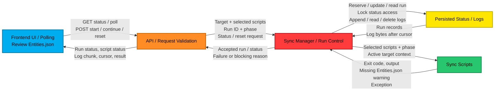
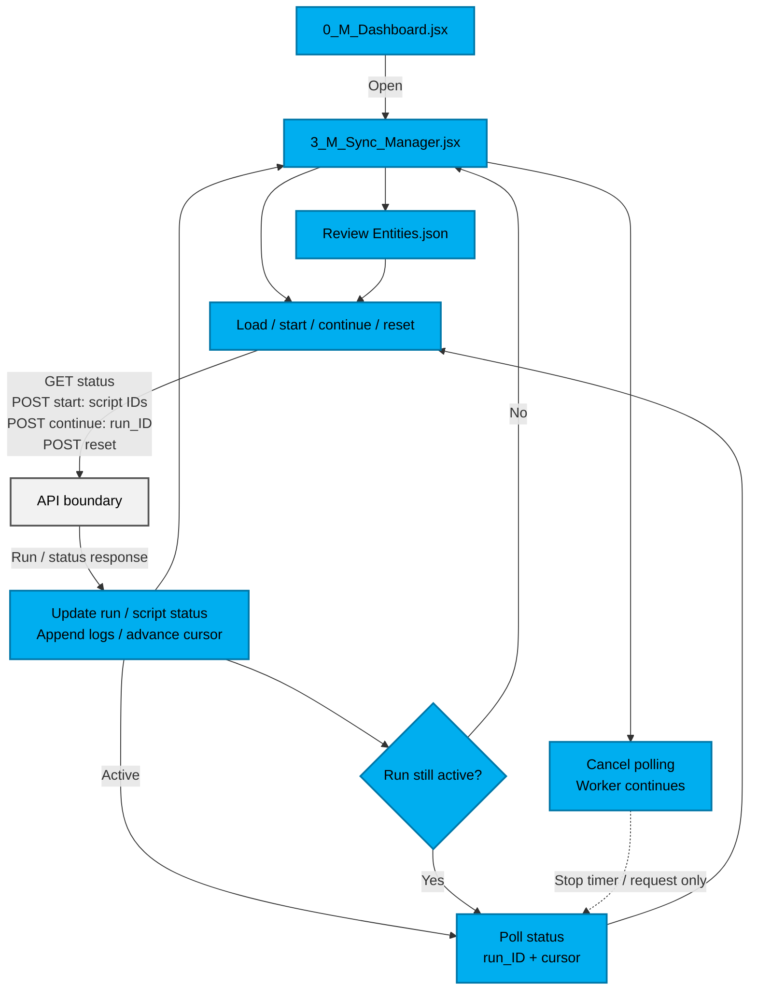
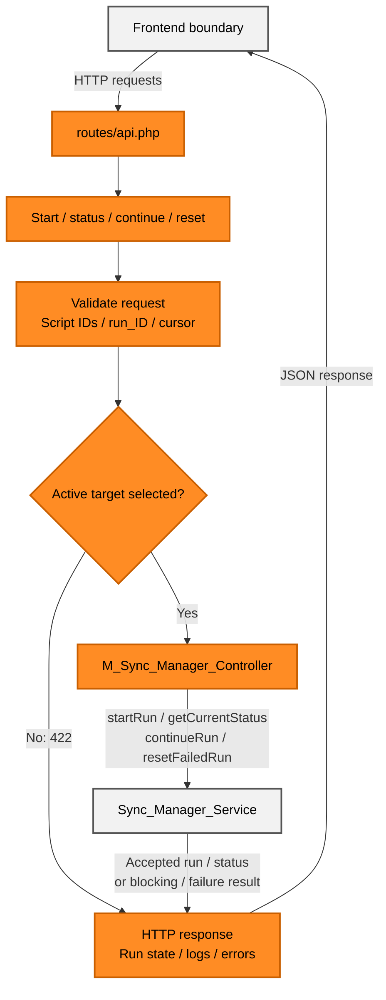
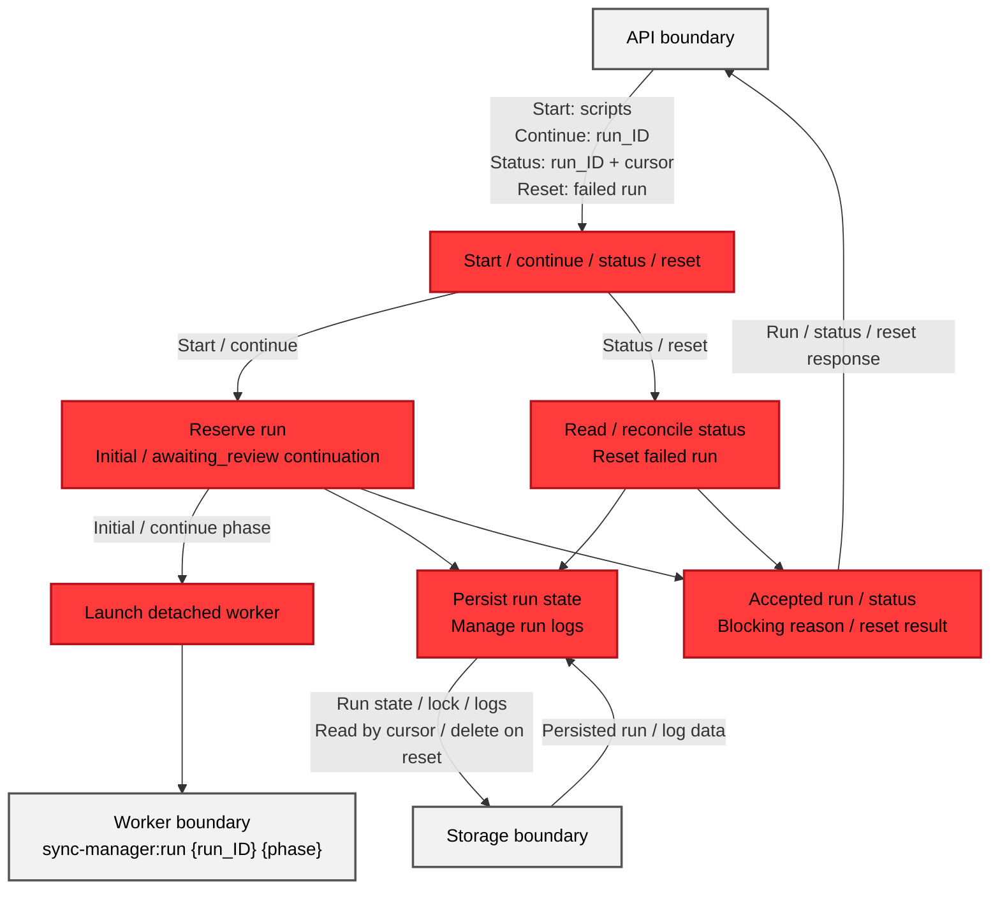
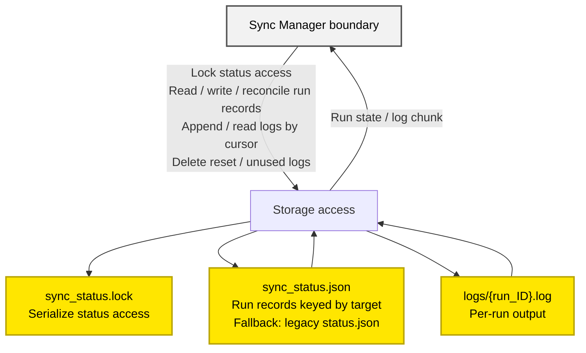
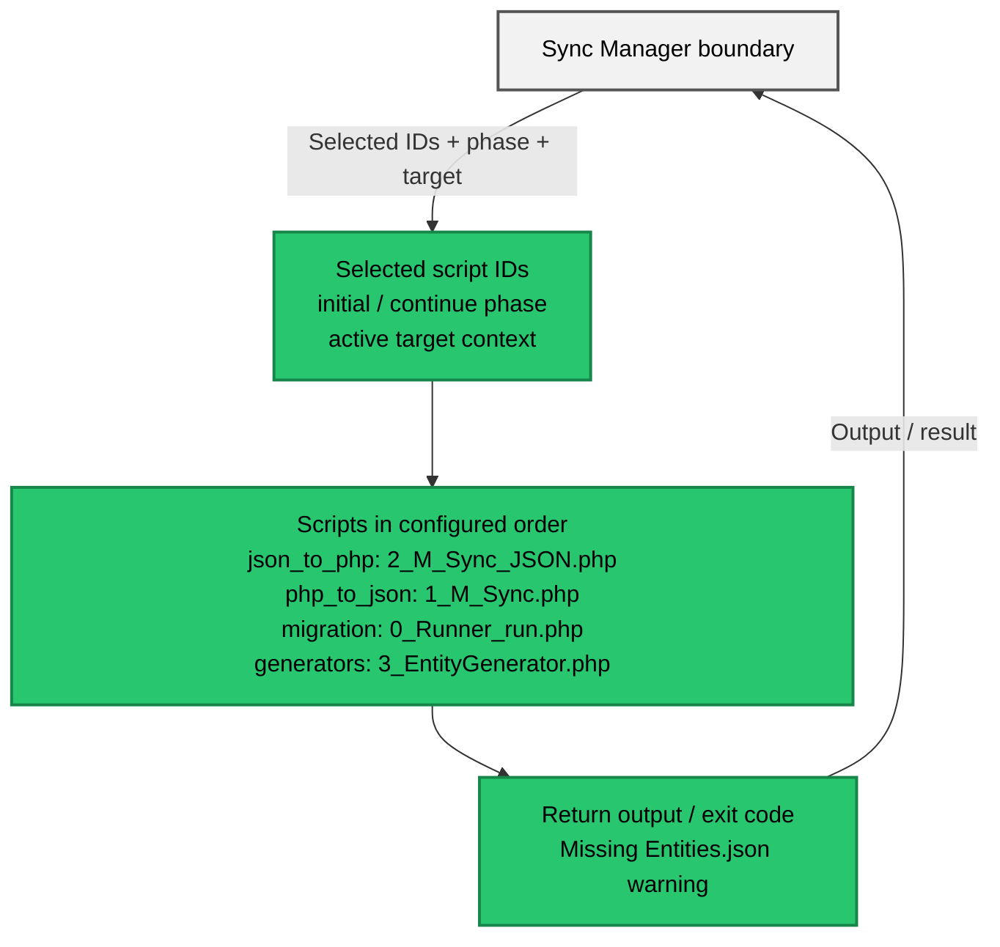

# Flow_Sync_Manager

## System Overview

## Frontend UI / Polling

## API / Request Validation

## Sync Manager / Run Reservation

## Sync Manager / Worker Execution

## Persisted Status / Logs

## Sync Scripts

