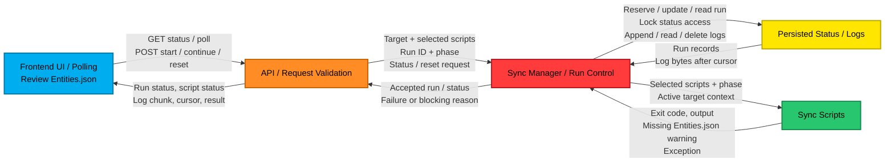
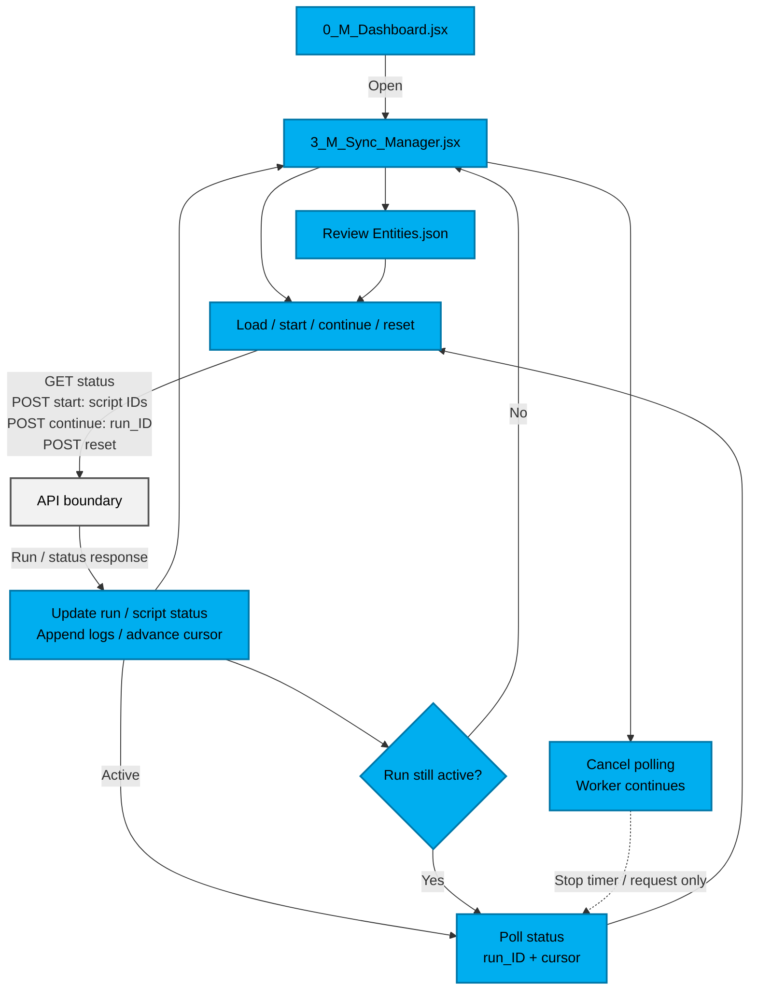
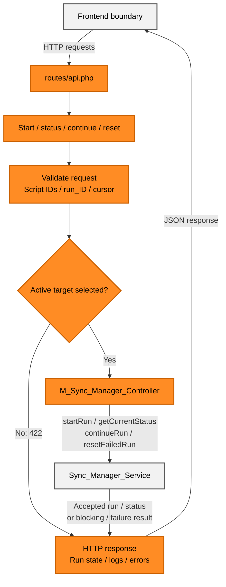
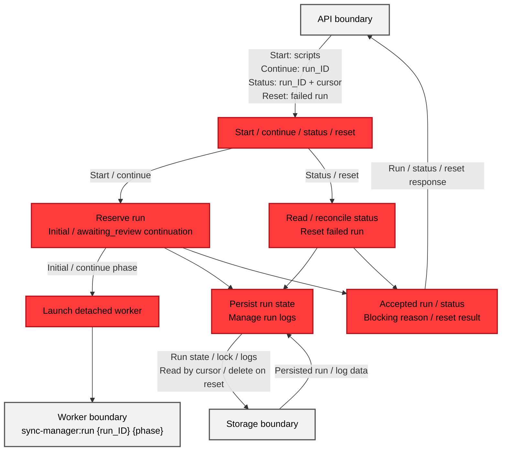
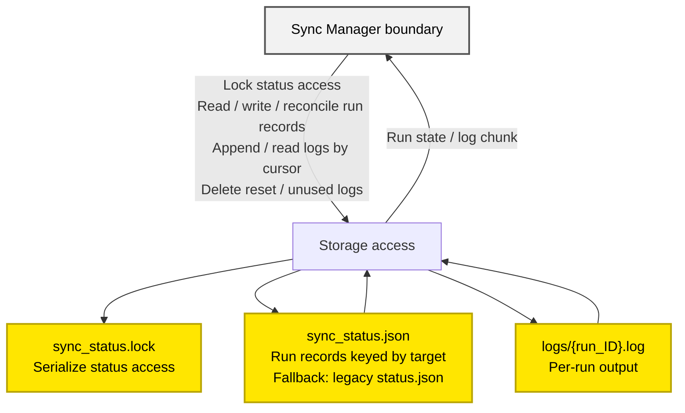
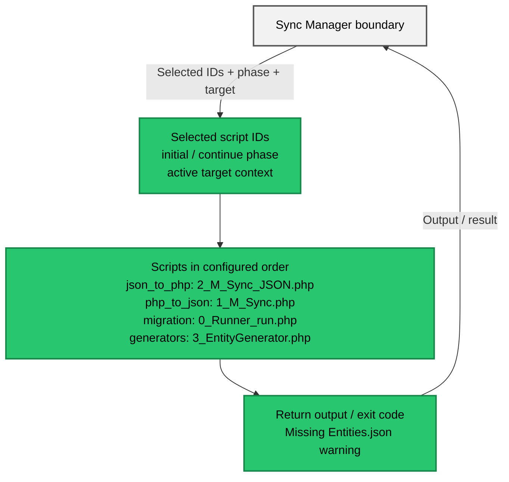

# Flow_Sync_Manager

## System Overview

## Diagram Details

### Frontend UI / Polling

**Responsibility:** Opens the Sync Manager, starts or continues runs, reviews run status, and displays logs.

**Example:** `run_ID + cursor` → request new log bytes → append logs and advance the cursor.

### API / Request Validation

**Responsibility:** Validates requests and active target, then returns Sync Manager results through HTTP.

**Example:** `scripts: ["json_to_php"]` → validate ID → `startRun()` → JSON response.

### Sync Manager / Run Reservation

**Responsibility:** Reserves a target run, persists its state, and launches the detached worker.

**Example:** `target + script IDs` → `run_ID + initial phase` → worker command.

### Sync Manager / Worker Execution

**Responsibility:** Executes the scripts for a phase and records each result.

**Example:** `initial_scripts` → `running` → `awaiting_review`, `completed`, or `failed`.

### Persisted Status / Logs

**Responsibility:** Stores shared run state and private per-run output for workers and API requests.

**Example:** `sync_status.json` → run state; `logs/{run_ID}.log` → bytes after `cursor`; `sync_status.lock` → serialized status access.

### Sync Scripts

**Responsibility:** Maps selected script IDs and phase to the configured PHP scripts.

**Example:** `json_to_php` → `2_M_Sync_JSON.php`; worker receives script output and exit code.

